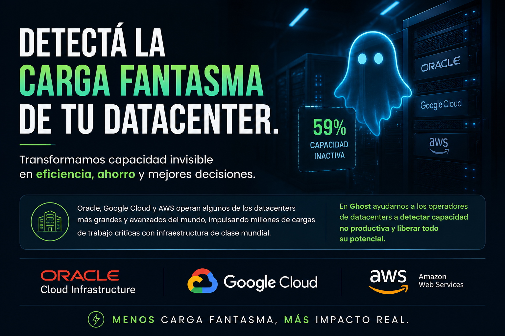
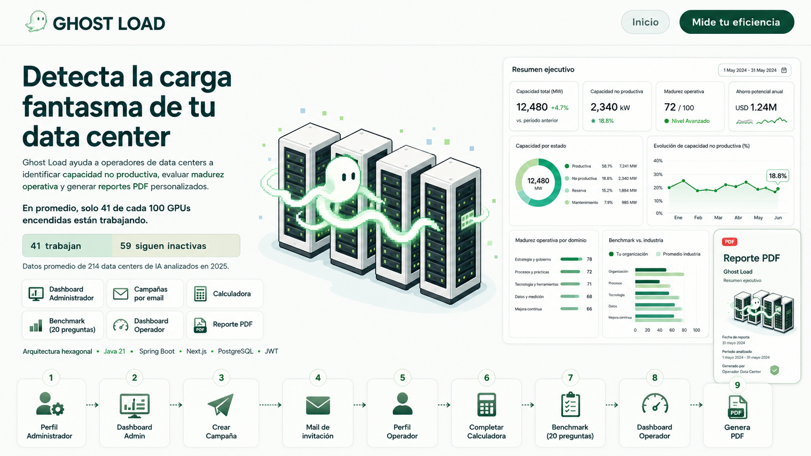
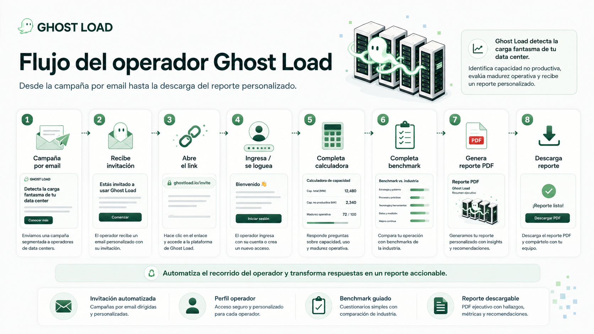
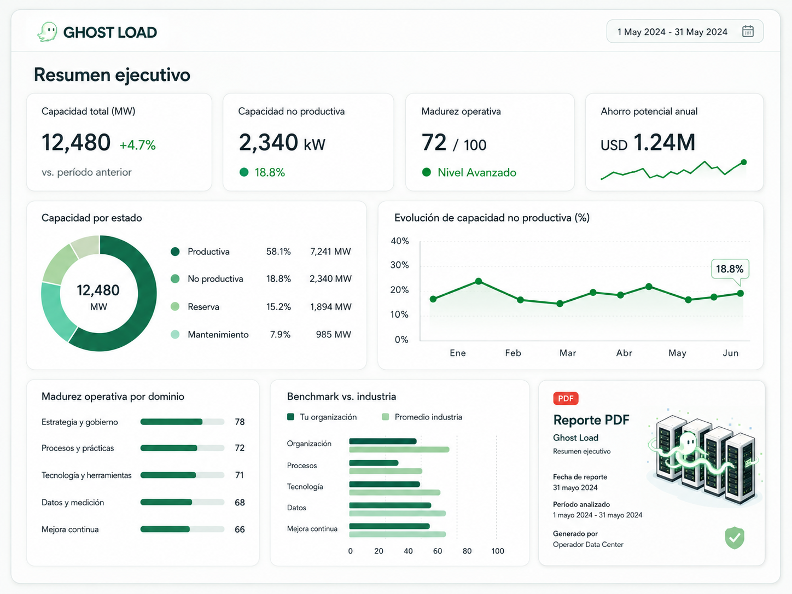
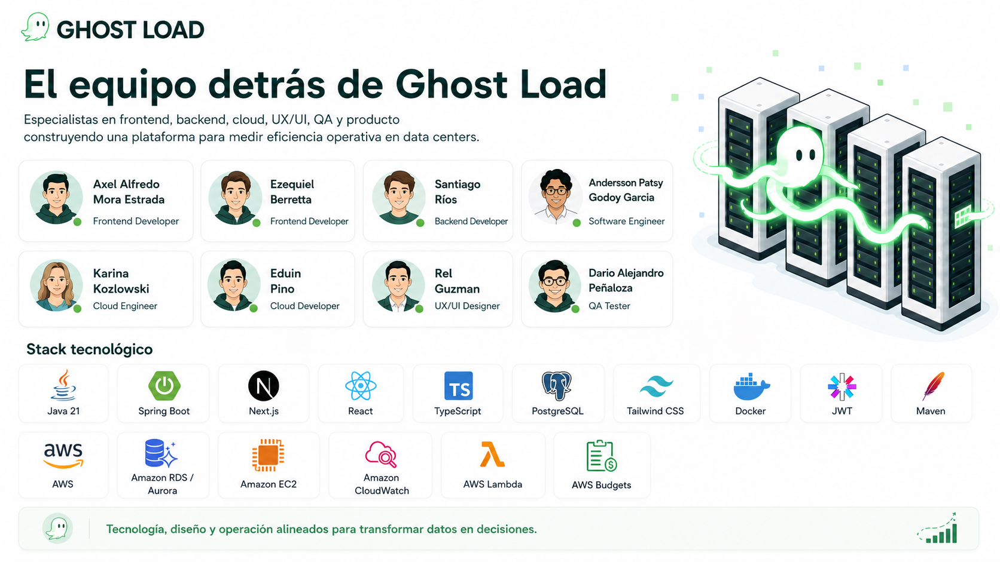
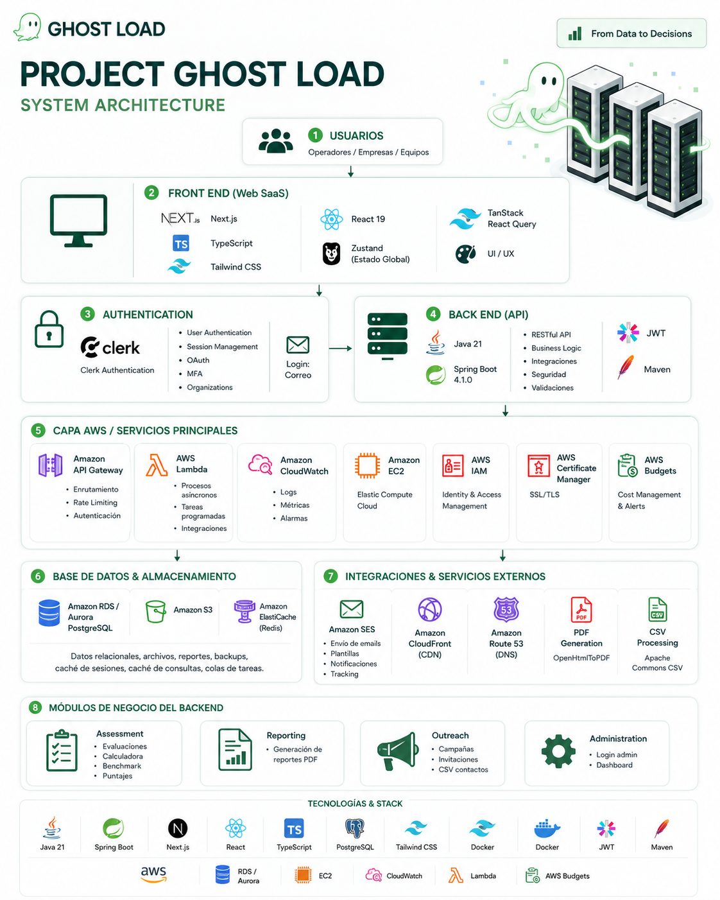

## AI Interprise Intellegent Business  | Gosht Load Server
**Identificador de Eficiencia de Data Centers**

Ghost Load es una aplicación empresarial para operadores de data centers que ayuda a identificar capacidad no productiva, evaluar madurez operativa y generar reportes PDF personalizados. El proyecto está diseñado como un monolito modular con una arquitectura hexagonal que separa el negocio de las tecnologías externas.
<br>
<br>



docs/images/Banner_Presentacion.png


<br>
<br>

## Flujo operativo

Ghost Load automatiza el recorrido completo del operador, desde la invitación hasta la generación del reporte final:

1. El administrador crea y envía una **campaña por email**.
2. El operador recibe la invitación e ingresa a la plataforma.
3. Completa la **calculadora de capacidad**.
4. Responde el **benchmark de madurez operativa**.
5. El sistema procesa los resultados y genera métricas e insights.
6. Finalmente, se crea un **reporte PDF personalizado** listo para descargar y compartir.
<br>
<br>



<br>
<br>


## Resumen ejecutivo

El dashboard ejecutivo de **Ghost Load** consolida los principales indicadores de eficiencia del data center en una única vista.

Permite visualizar la **capacidad total**, la **capacidad no productiva**, el nivel de **madurez operativa**, el **ahorro potencial** y la evolución de los principales KPIs.

Además, compara los resultados obtenidos con **benchmarks de la industria** y facilita la identificación de oportunidades de optimización para apoyar decisiones basadas en datos.
<br>
<br>


<br>
<br>


## El equipo detrás de Ghost Load

**Ghost Load** fue desarrollado por un equipo multidisciplinario que combina gestión de producto, arquitectura de software, desarrollo backend, frontend e infraestructura cloud.
El equipo trabaja de forma colaborativa para construir una solución **escalable, segura y orientada a datos**, integrando tecnologías modernas de desarrollo y servicios de **AWS Cloud**.



<br>
<br>





# Stack tecnológico

## Lenguajes

- **Java 21** — Backend
  - Aproximadamente **93.7%** del proyecto
  - Spring Boot 4.1.0

- **TypeScript** — Frontend
  - Aproximadamente **5.8%** del proyecto
  - React 19
  - Next.js 16.2.11

## Frameworks y runtime

### Backend

- **Spring Boot 4.1.0**
- **Java 21**
- **Maven**

### Frontend

- **Next.js 16.2.11**
- **React 19**
- **TypeScript**

## Tecnologías principales

- **Base de datos:** PostgreSQL 16
- **Autenticación:** JWT — JSON Web Tokens
- **Generación de PDF:** OpenHtmlToPDF
- **Procesamiento de CSV:** Apache Commons CSV
- **State Management:** Zustand
- **HTTP Client:** TanStack React Query
- **UI Components:** Lucide React
- **Estilos:** Tailwind CSS
- **Contenedores:** Docker
- **Cloud:** AWS

---

# Estructura del proyecto

```text
.
├── backend/                          # API REST con lógica de negocio
│   ├── src/main/java/com/ghostload/api/
│   │   ├── assessment/              # Evaluaciones y calculadora
│   │   ├── reporting/               # Generación de reportes PDF
│   │   ├── outreach/                # Campañas e invitaciones
│   │   ├── administration/          # Panel admin y login
│   │   ├── shared/                  # Código compartido
│   │   └── config/                  # Configuración Spring
│   ├── pom.xml                      # Dependencias Maven
│   ├── .env.example                 # Variables de entorno
│   └── Dockerfile
│
├── frontend/                         # Interfaz web con Next.js
│   ├── package.json
│   ├── Dockerfile
│   └── src/
│
├── docker-compose.yml               # Orquestación de servicios
├── README.md                        # Documentación principal
└── docs/
    ├── README.md
    ├── openapi.yaml                 # Contrato HTTP
    └── images/


---

# Ejecución con Docker

Todos los servicios se levantan desde el único `docker-compose.yml` ubicado en
la raíz del repositorio.

Primero crea el archivo local de variables y completa sus valores:

```powershell
Copy-Item backend/.env.example backend/.env
```

Después ejecuta, desde la raíz del repositorio:

```powershell
docker compose --env-file backend/.env up --build
```

No utilices solamente `docker compose up`, porque Docker Compose necesita las
variables definidas en `backend/.env`.

Cuando Docker informe que el backend está saludable, también puedes comprobarlo
manualmente sin autenticación:

```powershell
curl.exe http://localhost:8080/actuator/health
curl.exe http://localhost:8080/actuator/health/liveness
curl.exe http://localhost:8080/actuator/health/readiness
```

Los endpoints específicos devuelven `{"status":"UP"}` cuando el proceso está
vivo y el backend puede conectarse a PostgreSQL. El endpoint general también
enumera los grupos públicos `liveness` y `readiness`, pero no expone
credenciales ni detalles de los componentes internos.

Para detener todos los servicios:

```powershell
docker compose --env-file backend/.env down
```

---


