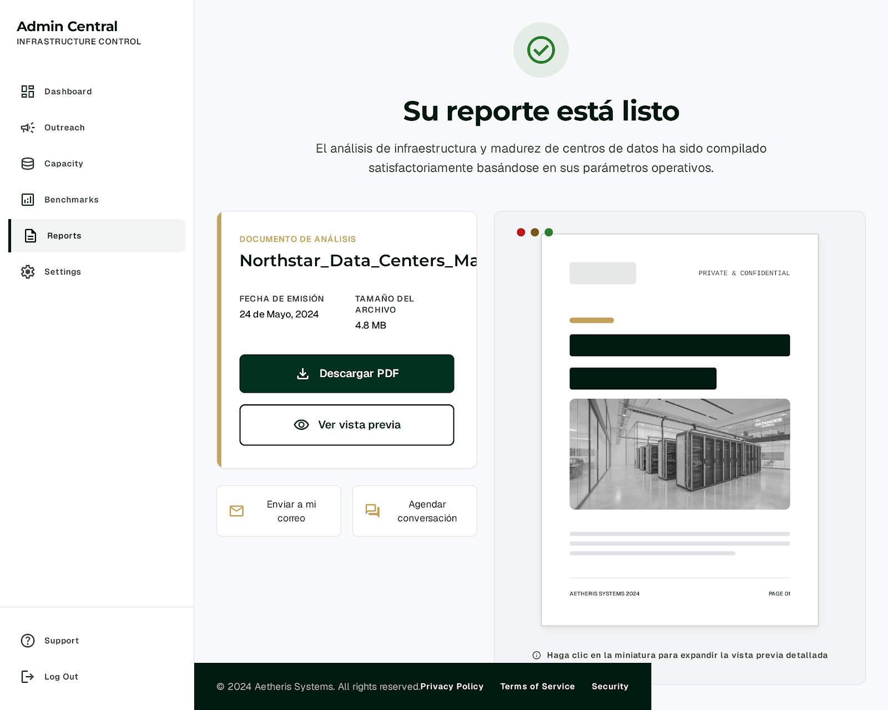

## AI Interprise Intellegent Business  | S07-26-Team-26


---

# Ejecución con Docker

Todos los servicios se levantan desde el único `docker-compose.yml` ubicado en
la raíz del repositorio.

Primero crea el archivo local de variables y completa sus valores:

```powershell
Copy-Item backend/.env.example backend/.env
```

Después ejecuta, desde la raíz del repositorio:

```powershell
docker compose --env-file backend/.env up --build
```

No utilices solamente `docker compose up`, porque Docker Compose necesita las
variables definidas en `backend/.env`.

Para detener todos los servicios:

```powershell
docker compose --env-file backend/.env down
```

---

# Frontend - Benchmark

Vista de la interfaz correspondiente al módulo de Benchmark.


---

# Frontend - Evaluación

Vista de la interfaz correspondiente al módulo de Evaluación.


---

# Descarga de Reporte

La siguiente imagen muestra la funcionalidad de descarga de reportes disponible en la aplicación.



<p align="center">
  <a href="docs/README.md">
    
  </a>
  <a href="docs/README.md">
    
  </a>
  <a href="docs/README.md">
    
  </a>
</p>

# Arquitectura

La siguiente imagen muestra la arquitectura general del sistema.


